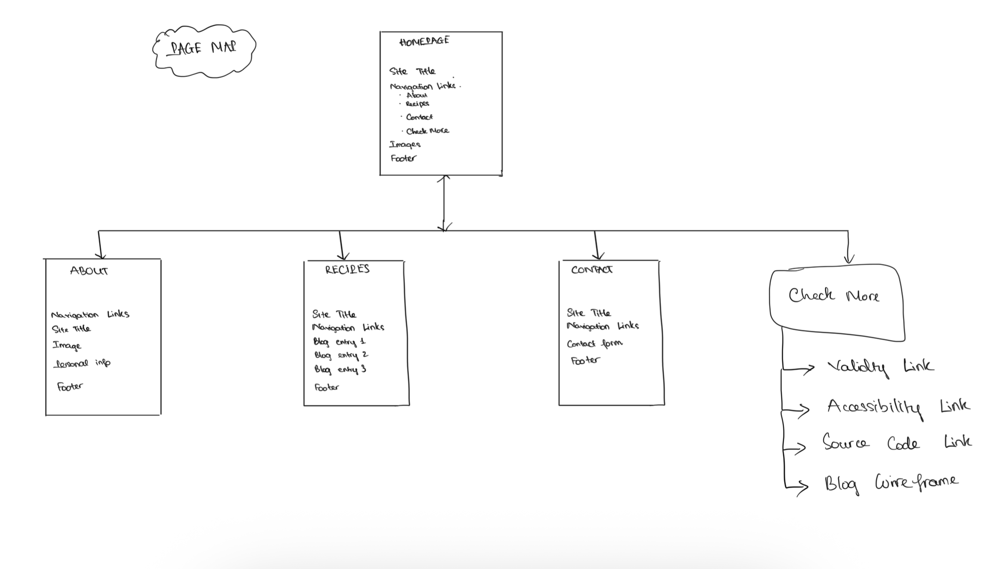
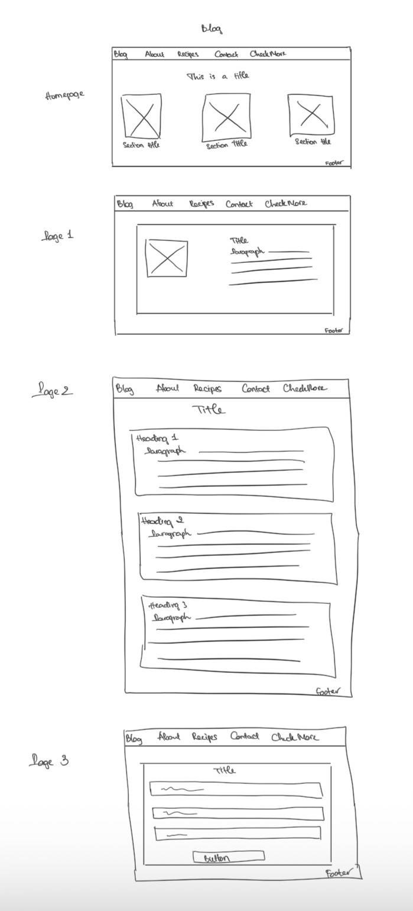

## Personal Blog Website – Nhu Tran 

## 📖 Overview
This is my personal blog project where I practice front-end web development and share a bit about myself.  
The site highlights my background, interests, and hobbies, while also serving as a portfolio to show what I’ve learned in **HTML**, **CSS**, **Bootstrap**, and **JavaScript**.  

---

## 🗂️ Page Map

- `index.html` → Homepage with introduction  
- `pages/about.html` → About Me page  
- `pages/recipes.html` → Recipes page  
- `pages/contact.html` → Contact page  
- `styles/style.css` → Custom styles for layout and design  
- `scripts/scripts.js` → JavaScript for interactivity
- `images/` → Food image, thumbnails, page map and wireframe image  

---

## 🖼️ Wireframe
The wireframe provides the initial sketch of how the homepage layout was planned.  

  

*(saved in `/assets/images/blog-wireframe-699x1539.jpg`)*  

---

## 🚀 How to View
- **Live Link:** [View Website](https://nhu-tran1105.github.io/NhuTran/)  

---

## 💻 Code Snippet
Here’s how I made a button trigger an alert:  

```html
<button id="btnClicky" class="btn btn-dark" type="button">Submit</button>

```javascripts
function handleBtnClick() {
  console.log('in btnClicky event');
  alert("Message Has Been Sent!!!");
  console.log('after message sent');
}

document.addEventListener("DOMContentLoaded", () => {
  console.log("document succesfully loaded, baby!");
  const btnClicky = document.getElementById('btnClicky'); 
  btnClicky.addEventListener('click', handleBtnClick);
});
```

---

## Explaination
The button is styled using Bootstrap.
JavaScript adds a click event listener to the button.
When clicked, it triggers an alert() popup with a message.

## Credit & Disclosure

Author: Nhu Tran

Collaboration: Independent project (no collaborators)

Tools Used:

Bootstrap 5 for layout and responsive design

Normalize.css for consistent styling across browsers

jQuery for simple DOM manipulation

Wireframe: Created using hand-drawn scan and saved to /images/
